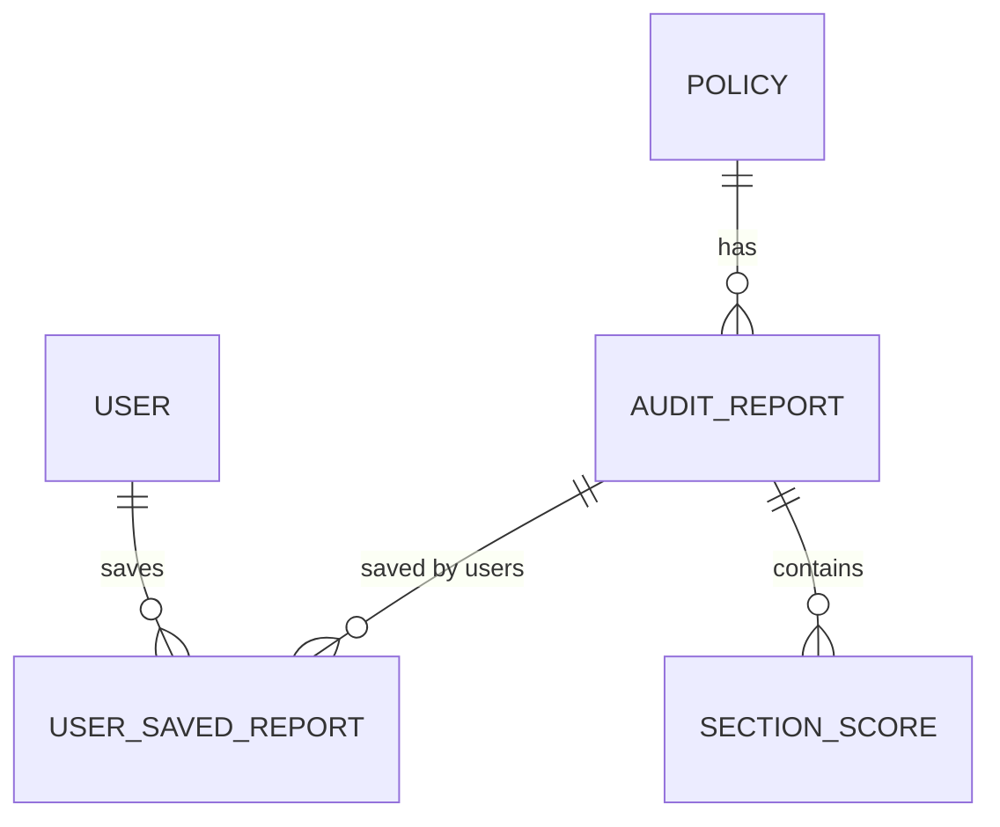

# Policy Analysis Database Tables

This document describes the new database tables added to support the policy analysis functionality in PolicyGlass.

## New Tables Overview

Four new tables have been added to the database schema to support policy document storage, audit reporting, and user dashboard features:

### 1. Policy Table
Stores the raw policy documents and their sources.

```prisma
model Policy {
  id          Int      @id @default(autoincrement())
  company_name String
  source_url  String
  terms_text  String
  raw_response String?
  created_at  DateTime @default(now())
  audit_reports AuditReport[]
}
```

### 2. AuditReport Table
Stores the complete audit results for each policy document.

```prisma
model AuditReport {
  id              Int      @id @default(autoincrement())
  policy_id       Int
  policy          Policy   @relation(fields: [policy_id], references: [id])
  total_score     Int
  letter_grade    String
  overall_summary String
  raw_audit_json  String?
  created_at      DateTime @default(now())
  section_scores  SectionScore[]
  saved_reports   UserSavedReport[]
}
```

### 3. SectionScore Table
Stores individual section scores and commentary within each audit report.

```prisma
model SectionScore {
  id          Int    @id @default(autoincrement())
  report_id   Int
  report      AuditReport @relation(fields: [report_id], references: [id])
  section_name String
  score       Int
  max_score   Int
  commentary  String
}
```

### 4. UserSavedReport Table
Tracks which audit reports users have saved to their dashboard with custom labels and notes.

```prisma
model UserSavedReport {
  id           Int    @id @default(autoincrement())
  user_id      Int
  user         User   @relation(fields: [user_id], references: [id])
  report_id    Int
  report       AuditReport @relation(fields: [report_id], references: [id])
  saved_at     DateTime @default(now())
  display_name String?
  notes        String?

  @@index([user_id])
  @@index([report_id])
}
```

## Database Migration Script

The following SQL migration script has been generated and can be applied to update the database schema:

```sql
-- CreateTable
CREATE TABLE "Policy" (
    "id" INTEGER NOT NULL PRIMARY KEY AUTOINCREMENT,
    "company_name" TEXT NOT NULL,
    "source_url" TEXT NOT NULL,
    "terms_text" TEXT NOT NULL,
    "raw_response" TEXT,
    "created_at" DATETIME NOT NULL DEFAULT CURRENT_TIMESTAMP
);

-- CreateTable
CREATE TABLE "AuditReport" (
    "id" INTEGER NOT NULL PRIMARY KEY AUTOINCREMENT,
    "policy_id" INTEGER NOT NULL,
    "total_score" INTEGER NOT NULL,
    "letter_grade" TEXT NOT NULL,
    "overall_summary" TEXT NOT NULL,
    "raw_audit_json" TEXT,
    "created_at" DATETIME NOT NULL DEFAULT CURRENT_TIMESTAMP,
    CONSTRAINT "AuditReport_policy_id_fkey" FOREIGN KEY ("policy_id") REFERENCES "Policy" ("id") ON DELETE RESTRICT ON UPDATE CASCADE
);

-- CreateTable
CREATE TABLE "SectionScore" (
    "id" INTEGER NOT NULL PRIMARY KEY AUTOINCREMENT,
    "report_id" INTEGER NOT NULL,
    "section_name" TEXT NOT NULL,
    "score" INTEGER NOT NULL,
    "max_score" INTEGER NOT NULL,
    "commentary" TEXT NOT NULL,
    CONSTRAINT "SectionScore_report_id_fkey" FOREIGN KEY ("report_id") REFERENCES "AuditReport" ("id") ON DELETE RESTRICT ON UPDATE CASCADE
);

-- CreateTable
CREATE TABLE "UserSavedReport" (
    "id" INTEGER NOT NULL PRIMARY KEY AUTOINCREMENT,
    "user_id" INTEGER NOT NULL,
    "report_id" INTEGER NOT NULL,
    "saved_at" DATETIME NOT NULL DEFAULT CURRENT_TIMESTAMP,
    "display_name" TEXT,
    "notes" TEXT,
    CONSTRAINT "UserSavedReport_user_id_fkey" FOREIGN KEY ("user_id") REFERENCES "User" ("id") ON DELETE RESTRICT ON UPDATE CASCADE,
    CONSTRAINT "UserSavedReport_report_id_fkey" FOREIGN KEY ("report_id") REFERENCES "AuditReport" ("id") ON DELETE RESTRICT ON UPDATE CASCADE
);

-- CreateIndex
CREATE INDEX "UserSavedReport_user_id_idx" ON "UserSavedReport"("user_id");

-- CreateIndex
CREATE INDEX "UserSavedReport_report_id_idx" ON "UserSavedReport"("report_id");
```

## Entity Relationship Diagram

The updated database schema includes the following relationships:



## Migration Process

To apply these database changes:

1. Ensure you have the latest Prisma schema updates
2. Run the migration using Prisma CLI:
   ```bash
   npx prisma migrate dev --name add_policy_tables
   ```
3. Or apply the SQL script directly to your database

The migration has been designed to be backward-compatible and will not affect existing authentication or user management functionality.
