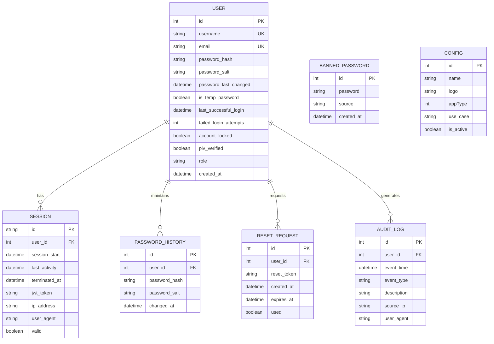
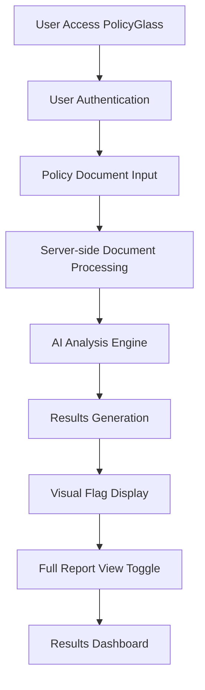

# System Architecture

## High-Level Overview
PolicyGlass is a Next.js web application that provides AI-powered policy document analysis. The system consists of:

- **Frontend**: Next.js 15 application with App Router architecture, TypeScript, and Tailwind CSS for styling
- **Backend**: Server-side processing with Prisma ORM for database operations
- **Database**: SQLite database (configured via DATABASE_URL environment variable)
- **Authentication**: Built-in user authentication system with session management
- **Data Models**: User management, password security, configuration, session tracking, and audit logging

The application follows a client-server architecture where policy documents are processed server-side for security and performance reasons. Users interact through a responsive web interface that provides real-time analysis results with visual flagging of potential issues.

## Database Schema
The application uses Prisma ORM with SQLite database. Key models and relationships:

## Key Processes

## File Structure
- **policyglass/src/app/**: Next.js App Router pages and layout components
  - **home/**: Main dashboard with policy input interface
  - **results/**: Analysis results display with flags and warnings
  - **layout.tsx**: Root layout with font configuration and global styles
  - **page.tsx**: Default landing page
- **policyglass/prisma/**: Database schema and Prisma configuration
  - **schema.prisma**: Data models for users, sessions, audit logs, etc.
- **memory-bank/**: Project memory and context documentation
