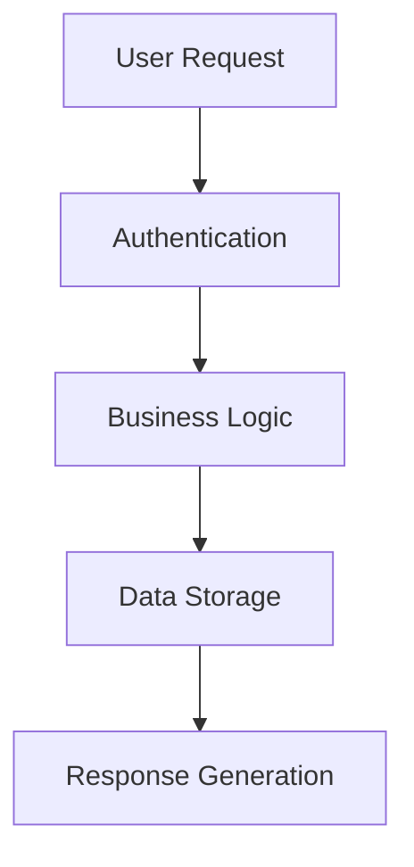

# System Architecture

## High-Level Overview
[Provide a high-level description of the system's structure here. Include major components and their interactions.]

## Database Schema
[Include database schema details if applicable. Use Mermaid diagrams or textual descriptions to illustrate relationships.]

## Key Processes
[Outline major system processes and workflows with flowcharts. Example:]

## File Structure
[Describe the organization of the codebase, key directories, and their purposes. Example:]
- **src/**: Core application code
- **tests/**: Unit and integration tests
- **config/**: Environment-specific configurations
