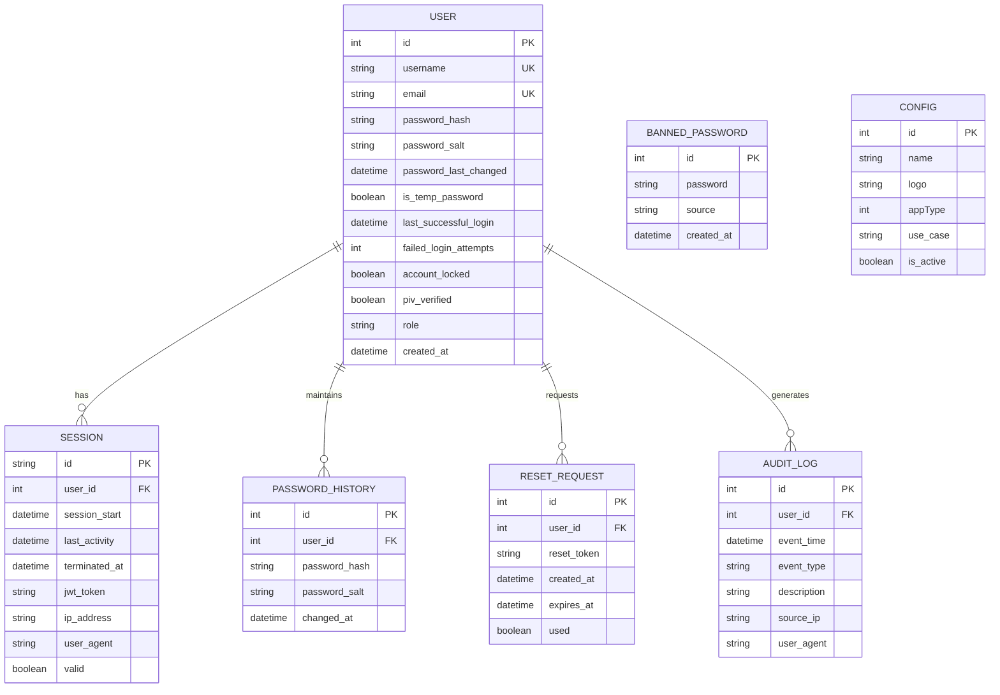
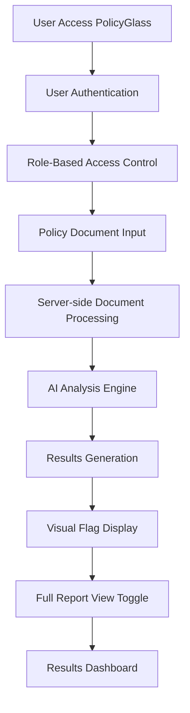

# System Architecture

## High-Level Overview
PolicyGlass is a Next.js web application that provides AI-powered policy document analysis. The system consists of:

- **Frontend**: Next.js 15 application with App Router architecture, TypeScript, and Sass for styling
- **Backend**: Server-side processing with Prisma ORM for database operations and API routes
- **Database**: SQLite database (configured via DATABASE_URL environment variable)
- **Authentication**: Comprehensive user authentication system with session management, RBAC, and security features
- **Data Models**: User management, password security, configuration, session tracking, audit logging, and password reset functionality

The application follows a client-server architecture where policy documents are processed server-side for security and performance reasons. Users interact through a responsive web interface that provides real-time analysis results with visual flagging of potential issues.

## Database Schema
The application uses Prisma ORM with SQLite database. Key models and relationships:

## Key Processes

## File Structure
- **policyglass/src/app/**: Next.js App Router pages and layout components
  - **home/**: Main landing page with navigation
  - **login/**: User login interface
  - **register/**: User registration interface
  - **dashboard/**: Authenticated user dashboard
  - **admin/**: Administrative dashboard and user management
  - **results/**: Analysis results display with flags and warnings
  - **layout.tsx**: Root layout with font configuration and global styles
  - **page.tsx**: Default landing page
- **policyglass/src/app/api/**: API routes for authentication and admin functionality
  - **auth/**: Authentication-related API endpoints (login, logout, register, password reset, verify)
  - **admin/**: Admin-only API endpoints (user management)
- **policyglass/src/app/controllers/**: Controller layer for handling business logic
  - **auth.controller.ts**: Authentication-related business logic
  - **admin.controller.ts**: Admin-related business logic
- **policyglass/src/app/services/**: Service layer for handling data access and external library concerns
  - **auth.service.ts**: Authentication data operations and user management
  - **admin.service.ts**: Admin data operations and user management
  - **password.service.ts**: Password hashing, validation, and reset operations
  - **session.service.ts**: Session management and validation operations
  - **audit.service.ts**: Audit logging operations
- **policyglass/src/app/components/**: Reusable React components for authentication and UI
- **policyglass/src/app/lib/**: Utility functions for session management and authentication
- **policyglass/prisma/**: Database schema and Prisma configuration
  - **schema.prisma**: Data models for users, sessions, audit logs, etc.
- **memory-bank/**: Project memory and context documentation
