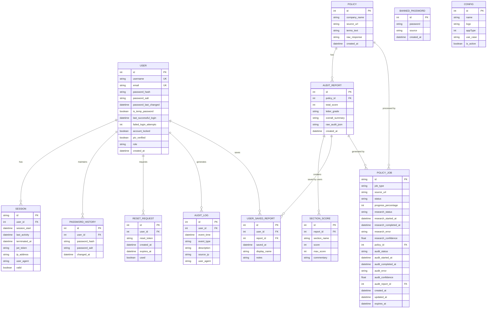
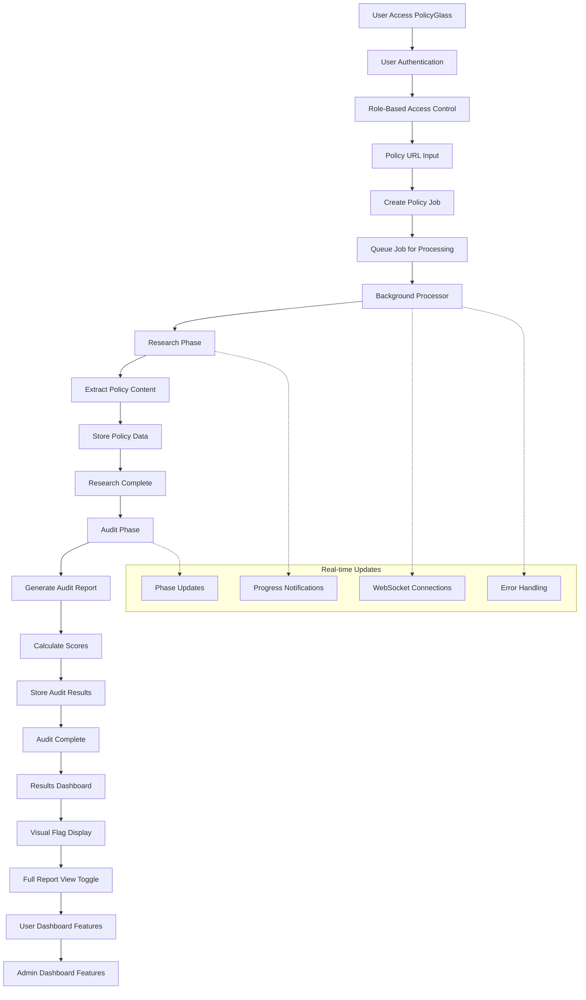
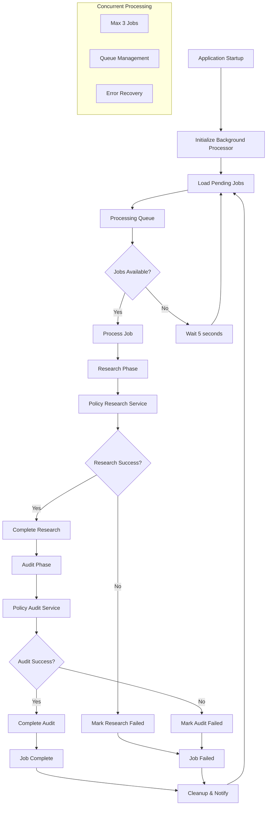

# System Architecture

## High-Level Overview
PolicyGlass is a Next.js web application that provides AI-powered policy document analysis. The system consists of:

- **Frontend**: Next.js 15 application with App Router architecture, TypeScript, and Sass for styling
- **Backend**: Server-side processing with Prisma ORM for database operations and API routes
- **Database**: SQLite database (configured via DATABASE_URL environment variable)
- **Authentication**: Comprehensive user authentication system with session management, RBAC, and security features
- **Data Models**: User management, password security, configuration, session tracking, audit logging, password reset functionality, and policy analysis storage

The application follows a client-server architecture where policy documents are processed server-side for security and performance reasons. Users interact through a responsive web interface that provides real-time analysis results with visual flagging of potential issues.

## Database Schema
The application uses Prisma ORM with SQLite database. Key models and relationships:

## Key Processes

### Policy Analysis Workflow

### Background Processing System

## File Structure
- **policyglass/src/app/**: Next.js App Router pages and layout components
  - **home/**: Main landing page with policy analysis input
  - **login/**: User login interface
  - **register/**: User registration interface
  - **dashboard/**: Authenticated user dashboard with role-based content
  - **admin/**: Administrative dashboard and user management
  - **results/**: Analysis results display with flags, warnings, and toggleable full report view
  - **api-docs/**: API documentation interface
  - **layout.tsx**: Root layout with font configuration and global styles
  - **page.tsx**: Default landing page
- **policyglass/src/app/api/**: API routes for authentication, policy analysis, and admin functionality
  - **auth/**: Authentication-related API endpoints (login, logout, register, password reset, verify)
  - **admin/**: Admin-only API endpoints (user management)
  - **policy/**: Policy analysis API endpoints
    - **[id]/**: Individual policy retrieval
    - **jobs/**: Job management endpoints (create, status, cancel)
    - **jobs/[jobId]/**: Individual job status and WebSocket connections
    - **research/**: Policy research endpoints
  - **health/**: System health monitoring endpoints
  - **docs/**: API documentation endpoints
- **policyglass/src/app/controllers/**: Controller layer for handling business logic
  - **auth.controller.ts**: Authentication-related business logic
  - **admin.controller.ts**: Admin-related business logic
  - **policy.controller.ts**: Policy analysis business logic
- **policyglass/src/app/services/**: Service layer for handling data access and external library concerns
  - **auth.service.ts**: Authentication data operations and user management
  - **admin.service.ts**: Admin data operations and user management
  - **password.service.ts**: Password hashing, validation, and reset operations
  - **session.service.ts**: Session management and validation operations
  - **audit.service.ts**: Audit logging operations
  - **policy-job.service.ts**: Policy job lifecycle management and database operations
  - **policy-research.service.ts**: Policy document research and extraction
  - **policy-audit.service.ts**: Policy audit report generation and analysis
  - **background-processor.service.ts**: Background job processing orchestration
  - **websocket.service.ts**: Real-time WebSocket communication management
  - **app-initializer.service.ts**: Application startup and service initialization
- **policyglass/src/app/components/**: Reusable React components for authentication and UI
- **policyglass/src/app/lib/**: Utility functions for session management and authentication
  - **schemas/**: Zod validation schemas for policy audit types
- **policyglass/src/app/types/**: TypeScript type definitions for policy audit system
- **policyglass/src/generated/**: Generated Prisma client code
- **policyglass/prisma/**: Database schema and Prisma configuration
  - **schema.prisma**: Data models for users, sessions, audit logs, policy documents, policy jobs, and analysis results
- **memory-bank/**: Project memory and context documentation
- **cline-docs/**: System documentation and glossary
